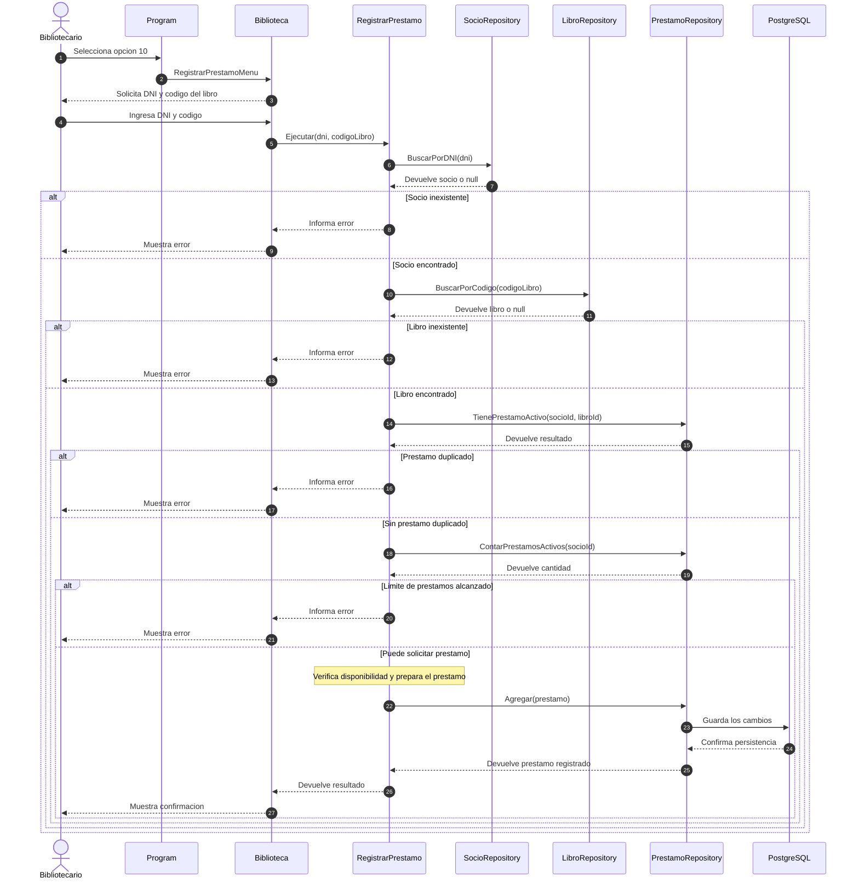

<!-- Para visualizar el diagrama UML, presionar Ctrl + Shift + V para abrir la vista previa de Markdown. -->

# UNAJBOOKS — Diagrama de secuencia: Registrar préstamo

```mermaid
sequenceDiagram
    autonumber

    actor Bibliotecario
    participant Program as Program
    participant UI as Biblioteca
    participant UC as RegistrarPrestamo
    participant SR as SocioRepository
    participant LR as LibroRepository
    participant PR as PrestamoRepository
    participant DB as PostgreSQL

    Bibliotecario->>Program: Selecciona opcion 10
    Program->>UI: RegistrarPrestamoMenu
    UI-->>Bibliotecario: Solicita DNI y codigo del libro
    Bibliotecario->>UI: Ingresa DNI y codigo

    UI->>UC: Ejecutar(dni, codigoLibro)

    UC->>SR: BuscarPorDNI(dni)
    SR-->>UC: Devuelve socio o null

    alt Socio inexistente
        UC-->>UI: Informa error
        UI-->>Bibliotecario: Muestra error
    else Socio encontrado
        UC->>LR: BuscarPorCodigo(codigoLibro)
        LR-->>UC: Devuelve libro o null

        alt Libro inexistente
            UC-->>UI: Informa error
            UI-->>Bibliotecario: Muestra error
        else Libro encontrado
            UC->>PR: TienePrestamoActivo(socioId, libroId)
            PR-->>UC: Devuelve resultado

            alt Prestamo duplicado
                UC-->>UI: Informa error
                UI-->>Bibliotecario: Muestra error
            else Sin prestamo duplicado
                UC->>PR: ContarPrestamosActivos(socioId)
                PR-->>UC: Devuelve cantidad

                alt Limite de prestamos alcanzado
                    UC-->>UI: Informa error
                    UI-->>Bibliotecario: Muestra error
                else Puede solicitar prestamo
                    Note over UC: Verifica disponibilidad y prepara el prestamo
                    UC->>PR: Agregar(prestamo)
                    PR->>DB: Guarda los cambios
                    DB-->>PR: Confirma persistencia
                    PR-->>UC: Devuelve prestamo registrado
                    UC-->>UI: Devuelve resultado
                    UI-->>Bibliotecario: Muestra confirmacion
                end
            end
        end
    end
```